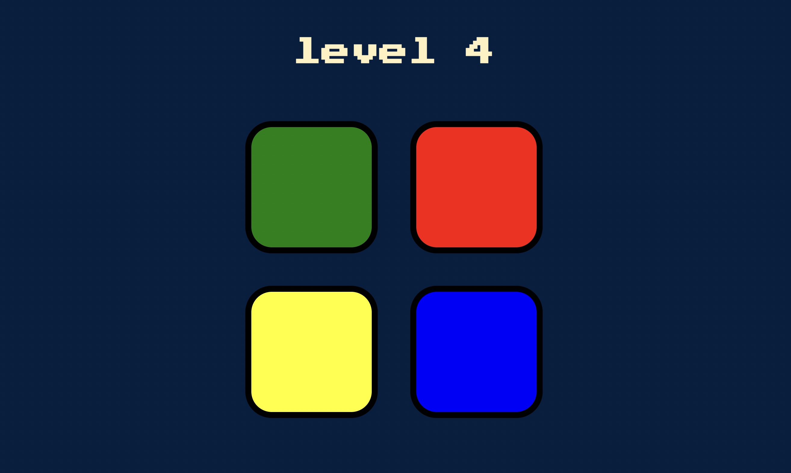

# Simon-Game

本项目为[Angela Yu网页开发课程](https://www.udemy.com/course/the-complete-web-development-bootcamp/)的课程项目之一，使用Javascript & jQuery复刻了经典的Simon游戏。 
This project presents a replica of the classic Simon game, as the course project for [Angela Yu's Web Development course on udemy](https://www.udemy.com/course/the-complete-web-development-bootcamp/).

HTML、CSS框架和音频文件来自课程材料；Javascript是按照课程提示从头开始编写的。 
The course provides skeleton files of HTML, CSS and sounds; the Javascript is written from scratch following the course hints and instructions.

演示视频为同一目录下的SimonGameDemoVid.mp4文件； 
演示网站（范例网站）在[此处](https://londonappbrewery.github.io/Simon-Game/)； 
有关Simon游戏的规则解释，可查阅[此页面](https://londonappbrewery.github.io/Simon-Game/)。 
Demo video of this project: the SimonGameDemoVid.mp4 file in this same directory. 
Demo site (example site) of the game can be found [here](https://londonappbrewery.github.io/Simon-Game/). 
Refer to [this page](https://en.wikipedia.org/wiki/Simon_(game)#Gameplay) for game rules explanation.

